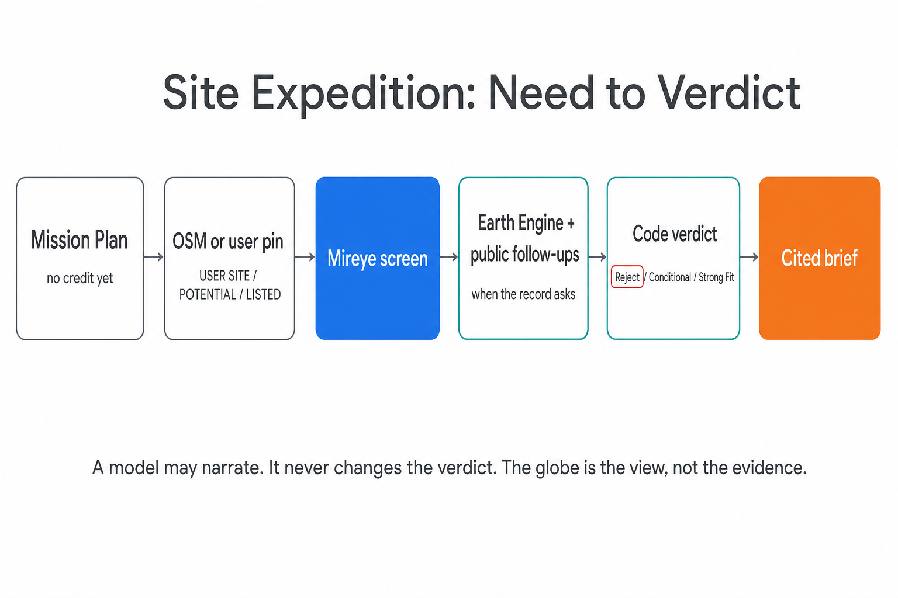
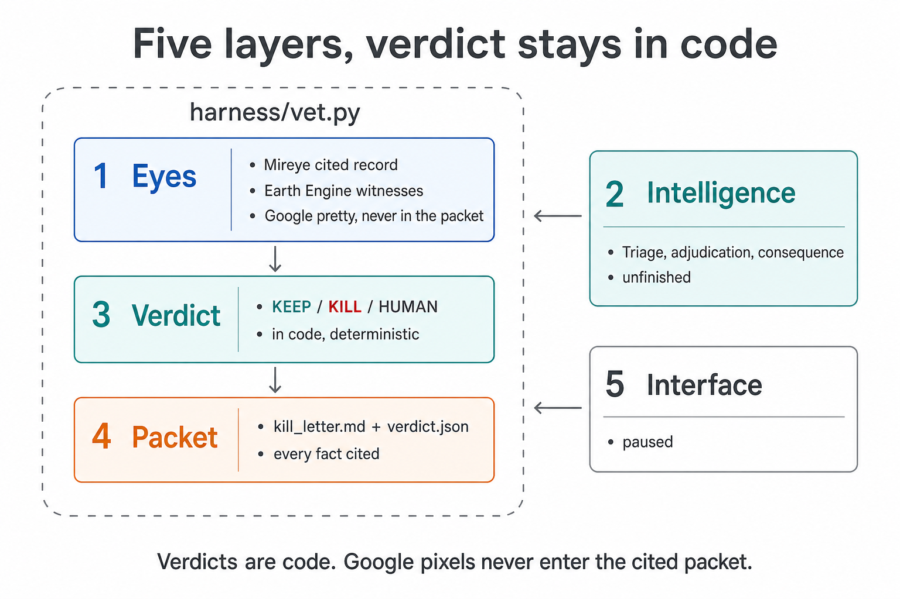
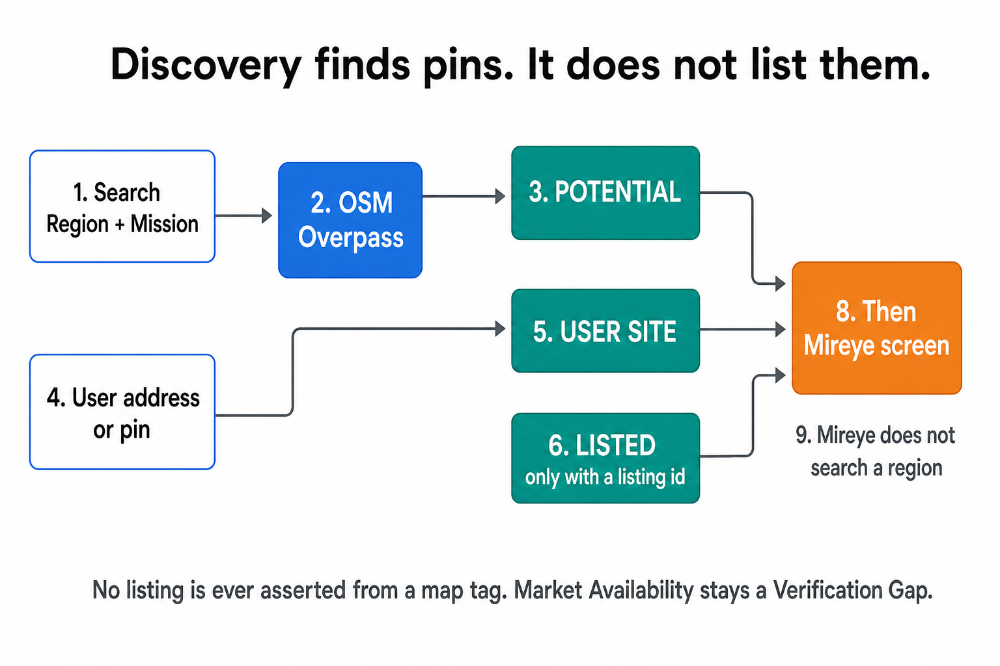
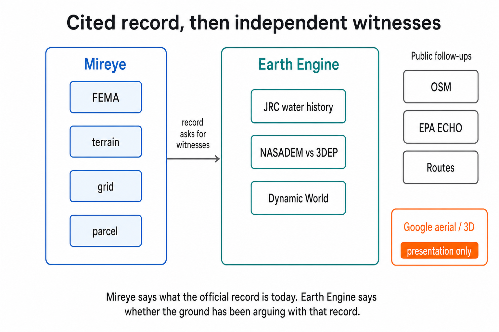

# Site Expedition

Live prototype: https://site-expedition-1027824348124.us-central1.run.app

Replay demo. Leave Live Mireye off. That path spends credits.

A US-only site-selection agent for the [Mireye Build Challenge](MIREYE_BUILD_CHALLENGE.md).

Mireye gave agents cited facts about a place: flood, terrain, grid, parcel. Eyes. Eyes are not a search. Someone still has to say what they are trying to place, find candidate pins, and decide. That is the slow, expensive part today.

This board takes the need, looks with Mireye, cross-checks with Earth Engine and public records, and tells you which pins survive. Google aerial and photorealistic 3D sit on the board so you can see the place you are about to kill or keep. The globe is the view. It is not the verdict.

Warehouse is the visual hero. Home, Farm, Data Center, and reviewed Custom missions share the same engine.

## What it does

1. Compiles a Mission Plan from the use before it spends a credit.
2. Discovers OpenStreetMap pins or takes a user address. Labels stay honest: `USER SITE`, `POTENTIAL`, `LISTED` only with a real listing assertion.
3. Screens with Mireye. Earth Engine and public follow-ups fire when the record itself makes them relevant.
4. Decides Reject, Conditional, or Strong Fit in deterministic code. A model may narrate. It never changes the verdict.
5. Emits a cited verification brief: who to call next, and why.

Mireye says what the official record is today. Earth Engine says whether the ground has been arguing with that record.

## How it computes

Four slides. Labels come from this README, `ONE_PAGER.md`, and `PRODUCT.md`. The loop that made them is in [`OPENAI_IMAGE_DIAGRAMS.md`](OPENAI_IMAGE_DIAGRAMS.md).

### Agent



A model may narrate. It never changes the verdict. The globe is the view, not the evidence.

### Harness



`harness/vet.py` is Eyes plus Verdict plus Packet. Intelligence is still the unfinished layer. Interface is paused. Verdicts are code. Google pixels never enter the cited packet.

### Discovery



OSM Overpass yields `POTENTIAL`. A user pin is `USER SITE`. `LISTED` only with a listing id. Mireye does not search a region. No listing is ever asserted from a map tag.

### Mireye



Mireye is FEMA, terrain, grid, parcel. Earth Engine is JRC water history, NASADEM vs 3DEP, Dynamic World. OSM, EPA ECHO, and Routes are follow-ups. Google aerial is presentation only.

## Run locally

Python 3.12+, from the repository root:

```bash
PYTHONPATH=. python3 -m expedition serve
```

The server binds to `127.0.0.1:8030`. First start writes a private token to `expedition/var/access-token`. Unlock the board with that token. Do not put it in a URL, screenshot, or checked-in file.

The two-minute demo runs on replay and spends 0 Mireye credits. Script: [`expedition/DEMO.md`](expedition/DEMO.md).

Live screening (`--live`) spends Mireye credits and needs credentials outside this repo (`~/.config/mireye-mcp/credentials.json`, Earth Engine, Google Maps). Quote-before-fetch and the credit ledger stay enforced.

## Verify

```bash
python3 scripts/validate_environment.py
PYTHONPATH=. python3 -m unittest discover -s expedition/tests
PYTHONPATH=. python3 -m expedition verify
```

Current gate is 253/253 tests. Browser smoke, scene startup, and HTTP stress runners live under `expedition.verify`. Details in [`expedition/README.md`](expedition/README.md).

## What's in this repo

| Path | What it is |
|---|---|
| [`expedition/`](expedition/) | The product. Board, engine, adapters, tests. |
| [`expedition/assets/architecture-diagrams/`](expedition/assets/architecture-diagrams/) | Agent, harness, discovery, and Mireye slides. |
| [`ONE_PAGER.md`](ONE_PAGER.md) | Challenge one-pager. |
| [`OPENAI_IMAGE_DIAGRAMS.md`](OPENAI_IMAGE_DIAGRAMS.md) | Codex imagegen playbook for Site Expedition and the insurance skin. Style lock, prompt schema, Stitch vs slides. |
| [`expedition/SUBMISSION.md`](expedition/SUBMISSION.md) | Judge-facing writeup. |
| [`harness/`](harness/) and [`iteration-1/`](iteration-1/)–[`iteration-7/`](iteration-7/) | Earlier KEEP/KILL packets that led here. |

The hosted board is a replay prototype, not production. Licensed national listings, zoning approval, water rights, and utility-capacity letters are deferred on purpose.

### Diagnostic and Verification Tools
- `python3 scripts/check_site_status.py`: Verify project configuration files and environment diagnostic readiness.
- `python3 scripts/validate_environment.py`: Check required environment variables and API integrations.
